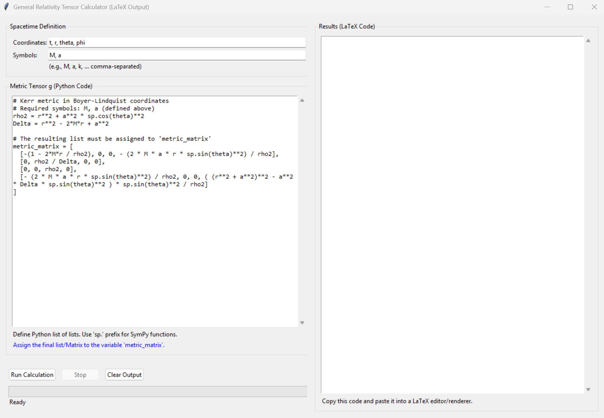

# General Relativity Tensor Calculator GUI

This application provides a graphical user interface (GUI) built with Tkinter for calculating various tensor quantities in General Relativity for a user-defined spacetime metric. It uses the SymPy library for symbolic computations.



## Features

*   **User-Defined Metric:** Input the metric tensor components as a Python list of lists using SymPy syntax.
*   **Symbolic Calculation:** Calculates the following quantities symbolically:
    *   Inverse Metric Tensor (g^{\mu\nu})
    *   Christoffel Symbols (\Gamma^{\rho}_{\mu\nu})
    *   Ricci Tensor (R_{\mu\nu})
    *   Ricci Scalar (R)
    *   Einstein Tensor (G_{\mu\nu})
    *   Mixed Einstein Tensor (G^{\mu}_{\nu})
    *   Covariant Divergence of the Einstein Tensor (\nabla_\nu G^{\mu\nu}) - *Should theoretically be zero for valid metrics.*
*   **LaTeX Output:** Generates LaTeX code for all calculated tensors, ready to be copied and pasted into a LaTeX document or renderer.
*   **Asynchronous Calculation:** Performs calculations in a separate thread to keep the GUI responsive.
*   **Progress Tracking:** Shows the progress of the calculation stages.
*   **Calculation Interruption:** Allows stopping the ongoing calculation.
*   **Default Metric:** Loads the Kerr metric by default for quick testing.

## How to Use

1.  **Dependencies:** Ensure you have Python 3 and SymPy installed (`pip install sympy`). Tkinter is usually included with standard Python installations.
2.  **Run the Application:** Execute the script from your terminal:
    ```bash
    python tensor_calculator_gui.py
    ```
3.  **Input Parameters:**
    *   **Coordinates:** Enter the names of your coordinates, comma-separated (e.g., `t, r, theta, phi`). These will be treated as SymPy symbols.
    *   **Symbols:** Enter any constant symbols used in your metric, comma-separated (e.g., `M, a, k`). These will also be treated as SymPy symbols (assumed real and positive).
    *   **Metric Tensor g (Python Code):** Define the metric tensor components. This must be Python code that:
        *   Uses the coordinate and symbol names defined above.
        *   Uses SymPy functions with the `sp.` prefix (e.g., `sp.sin(theta)`, `sp.exp(k/r)`).
        *   Assigns the final metric (as a Python list of lists or a `sp.Matrix` object) to a variable named exactly `metric_matrix`.
4.  **Run Calculation:** Click the "Run Calculation" button.
5.  **View Output:** The LaTeX code for the calculated tensors will appear in the right-hand text area as the calculation progresses.
6.  **Copy Output:** Select and copy the LaTeX code from the output area.
7.  **Stop/Clear:** Use the "Stop" button to interrupt a running calculation or "Clear Output" to clear the results area.

## License

This project is licensed under the MIT License - see the [LICENSE](LICENSE) file for details. 
